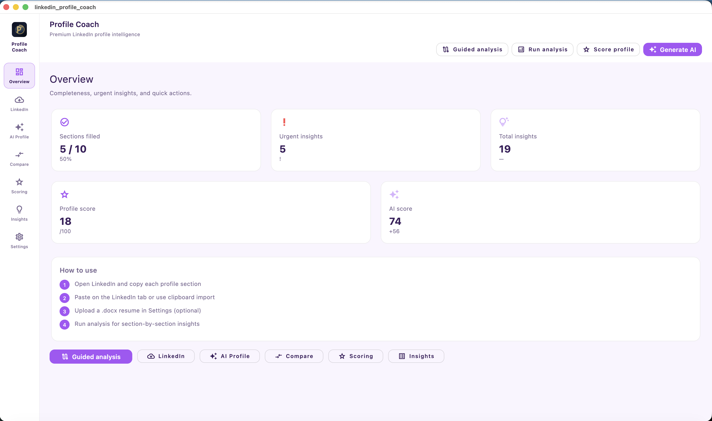
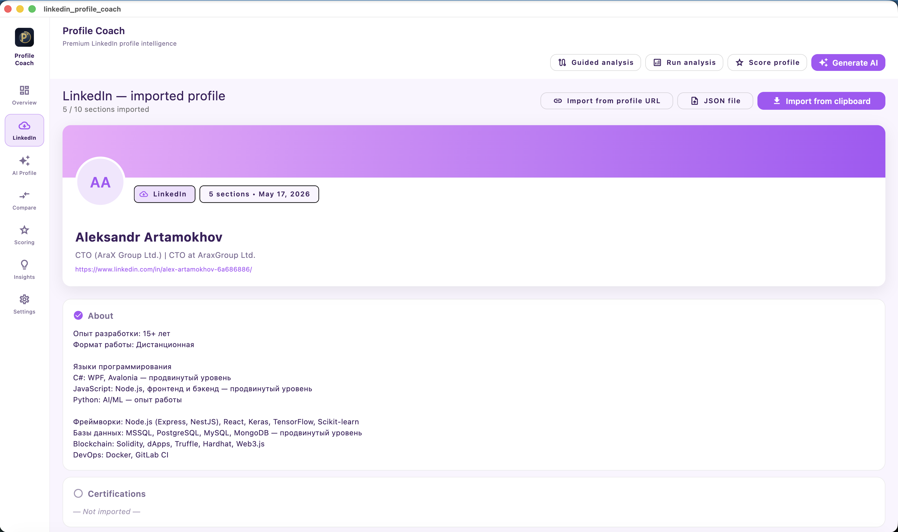
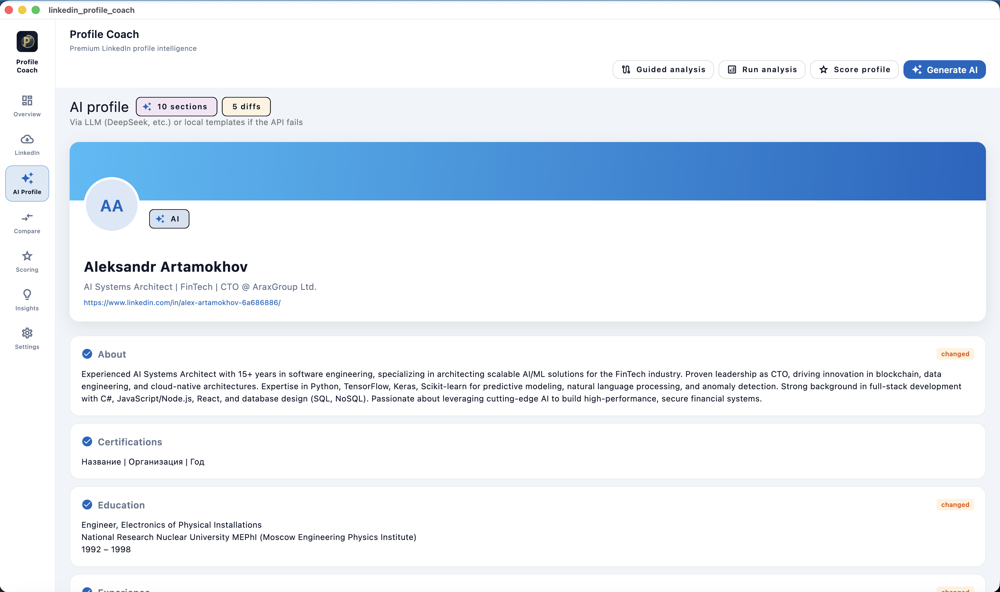
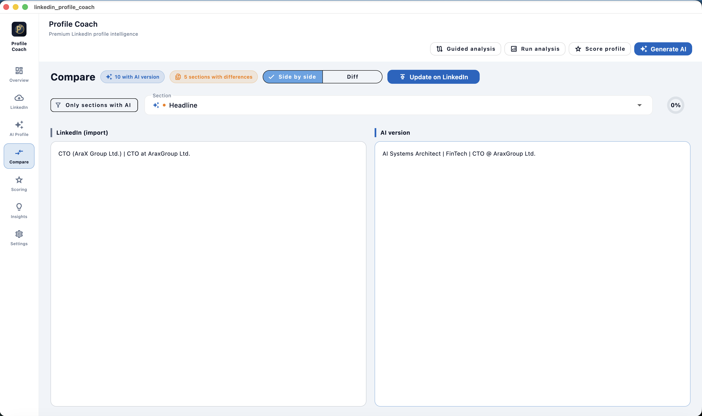
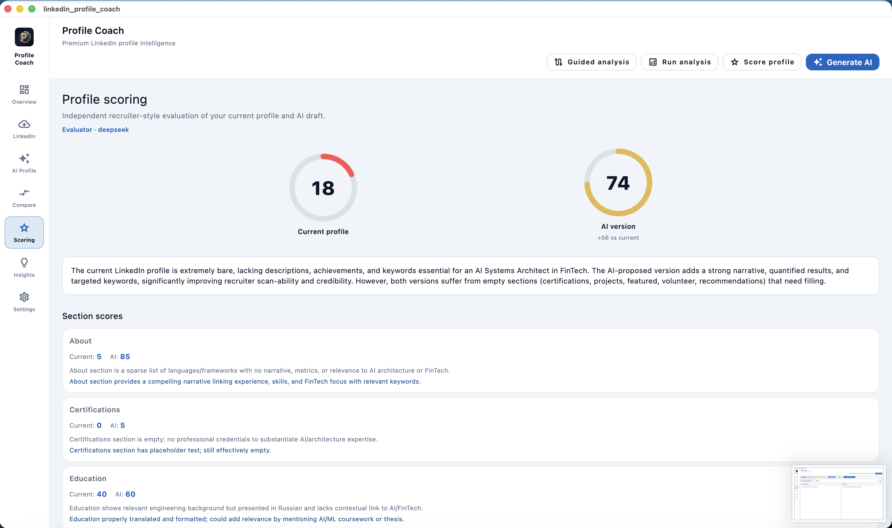
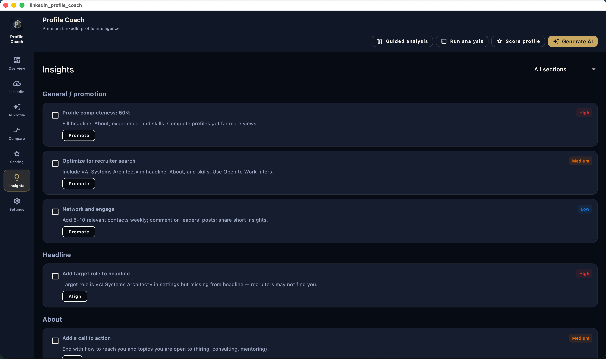
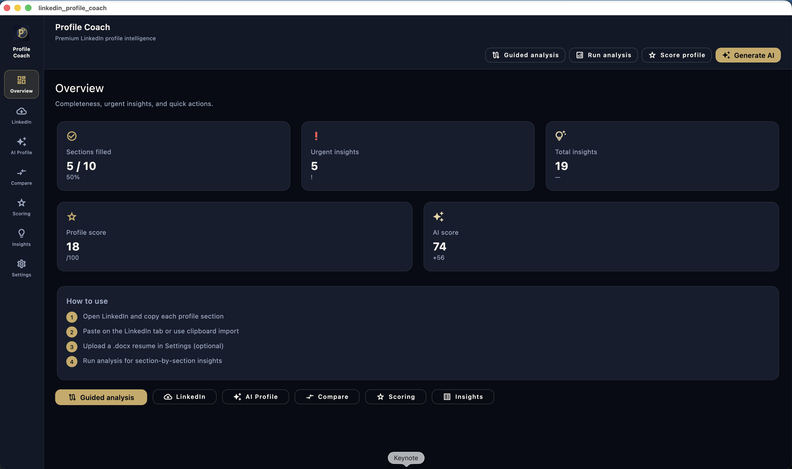
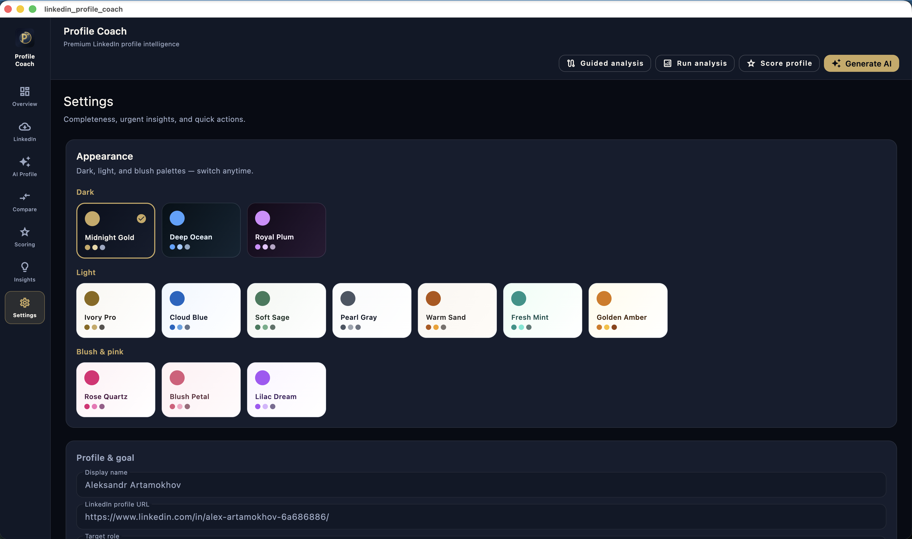
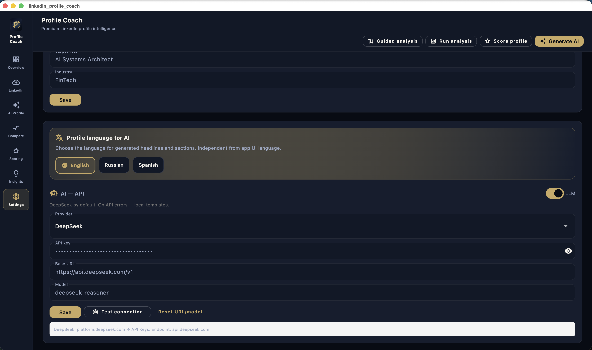

# LinkedIn Profile Coach

[](LICENSE)
[](https://github.com/alexar76/linked-in-profile-coach/actions/workflows/ci.yml)

Flutter desktop/mobile app: import **24 LinkedIn sections**, merge on refresh, analytics dashboard, AI draft, compare, scoring, insights, snapshots, and `.docx` resume support.

## Screenshots

| Overview | LinkedIn | AI profile |
|----------|----------|------------|
|  |  |  |

| Compare | Scoring | Insights |
|---------|---------|----------|
|  |  |  |

| Overview (dark) | Settings — themes | Settings — AI |
|-----------------|-------------------|---------------|
|  |  |  |

Full gallery: **[docs/screens/](docs/screens/)** · Compare mockups: **[docs/images/](docs/images/)**

## Documentation

- **[docs/USER_GUIDE.md](docs/USER_GUIDE.md)** — step-by-step user guide
- **[docs/screens/](docs/screens/)** — app screenshot gallery (real UI)
- **[docs/images/](docs/images/)** — compare tab illustrations
- [docs/RELEASE.md](docs/RELEASE.md) — builds and releases

## Contributing & security

- [CONTRIBUTING.md](CONTRIBUTING.md) — development and pull requests
- [SECURITY.md](SECURITY.md) — report vulnerabilities (not via public issues)
- [LICENSE](LICENSE) — MIT

## Download (releases)

Binaries are published on **[GitHub Releases](https://github.com/alexar76/linked-in-profile-coach/releases)**:

| Platform | File |
|----------|------|
| macOS | `ProfileCoach-vX.Y.Z-macos.zip` |
| Windows | `ProfileCoach-vX.Y.Z-windows-x64.zip` |
| Android | `ProfileCoach-vX.Y.Z-android-universal.apk` |

**iOS** — App Store / TestFlight only, not via GitHub.

See [docs/RELEASE.md](docs/RELEASE.md) for versioning and local builds.

## Run from source

```bash
chmod +x run.sh && ./run.sh
```

Windows: `run.bat`

## Tabs

| Tab | Description |
|-----|-------------|
| **Overview** | Analytics dashboard: completeness, score trends, LinkedIn stats, ATS match |
| **LinkedIn** | 24 sections, **Refresh**, merge import, export ZIP, History |
| **AI profile** | Improved draft (toolbar **Generate AI**) |
| **Compare** | LinkedIn vs AI: side by side or diff |
| **Scoring** | Evaluator scores (separate agent) |
| **Insights** | Rule-based tips per section |
| **Settings** | Profile, AI, themes, **LinkedIn sync** watch folder |

## Wizards

- **Setup wizard** — first launch (language, goals, API, resume, optional paste)
- **Guided analysis** — toolbar: import → AI → review all sections → insights → publish

## Import & sync

- **Refresh from LinkedIn** — watch folder / last ZIP / profile URL + **merge dialog**
- **LinkedIn data export** — ZIP or JSON from linkedin.com data download
- **Clipboard / JSON** — all section headers (`HEADLINE`, `LANGUAGES`, `HONORS`, …)
- **Chrome extension** — `extension/linkedin-coach-helper/`
- **History** — restore snapshots before import

## Update LinkedIn (manual)

**Compare → Update on LinkedIn** for each section:

- **Copy AI text** — to clipboard
- **Open in LinkedIn** — edit form in the browser
- **Mark done** — after you paste on LinkedIn

> LinkedIn does **not** offer a public write API for personal profiles. One-click auto-publish is not possible without violating platform rules.

## AI generation (LLM)

**Settings → AI — API:**

| Provider | Default |
|----------|---------|
| **DeepSeek** | ✅ default |
| OpenAI | api.openai.com |
| OpenAI-compatible | custom base URL |
| Anthropic | separate API |
| LM Router | configurable URL |
| Ollama | localhost:11434 |

1. Paste API key (not required for Ollama).
2. **Test connection**.
3. **Generate AI** — LLM request; on failure, local templates are used.
